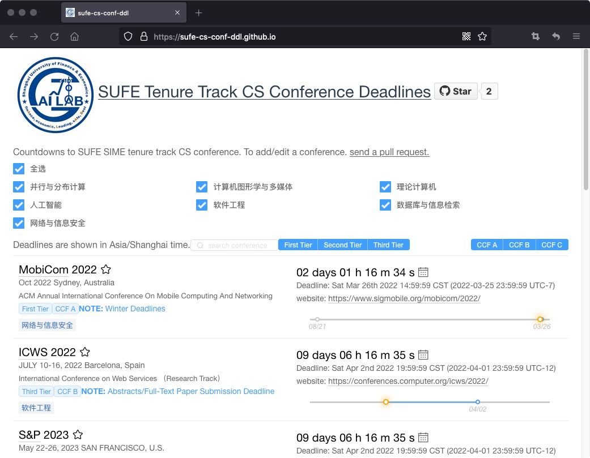

# sufe-cs-conf-ddl

English Docs | [中文文档](./README.zh-CN.md)

A DDL⏳Countdown tools🔧 for a SUFE SIMEr to track down CS conference in tenure track lists,
which can retrieve conference through CCF and TierLevel rank🎰. 
We provide a double search filtering system to derive THE conference you really cares about⏰.

If you find it useful for your reseach, plz collect❤️ the [website](https://sufe-cs-conf-ddl.github.io/), SHARE and STAR🌟 the project!

Refer to this [site](https://github.com/lixin4ever/Conference-Acceptance-Rate) to know about the conference acceptance ratio in different confs.

Sincerely hope everyone can publish the paper successfully🎉and derive significant research results!🍾
## Demo:

[](https://github.com/SUFE-CS-CONF-DDL/sufe-cs-conf-ddl/blob/main/.conf_list/screenshot.png)


## Conference schema file
The example yaml file of conference scripts: 

```yaml
- title: SIGIR
  description: International Conference on Research on Development in Information Retrieval
  sub: DBIR
  rank: A
  TierLevel: Second
  dblp: sigir
  confs:
    - year: 2021
      id: sigir21
      link: http://sigir.org/sigir2021/
      timeline:
        - abstract_deadline: '2021-02-02 23:59:59'
          deadline: '2021-02-09 23:59:59'
      timezone: AoE
      date: July 11-15, 2021
      place: Virtual
    - year: 2022
      id: sigir22
      link: https://sigir.org/sigir2022/
      timeline:
        - abstract_deadline: '2022-01-21 23:59:59'
          deadline: '2022-01-28 23:59:59'
      timezone: AoE
      date: July 11-15, 2022
      place: Madrid, Spain
```
Descriptions of all above scipts items.

> **Description of yaml items**
>
> - `title`: Short name of conference in CAPITAL, i.e. SIGIR
> - `descripition`: Full name of conference, i.e. International Conference on Research on Development in Information Retrieval
> - `sub`: The conference category defines in tenure track lists, which is nearly similiar to CCF lists. i.e. DBIR. The detailed information can be found below.
> - `rank`: [CCF level](https://www.ccf.org.cn/c/2019-04-25/663625.shtml) of the conferece. i.e. A
> - `TierLevel`: [Tier Level](https://github.com/SUFE-CS-CONF-DDL/sufe-cs-conf-ddl/blob/main/.conf_list/SIME_tenure_CCF.xlsx) in SUFE SIME of the conference i.e. Second Tier.
> - `dblp`: Suffix in dblp url, usually the lower-case of conf's short name. i.e. https://dblp.uni-trier.de/db/conf/sigir
> - `confs`:
>   - `year`: The holding year, i.e. 2022
>   - `id`: conf name in lower-case&year, i.e. sigir22
>   - `link`: Home page url of conference. i.e. https://sigir.org/sigir2022/
>   - `timeline`:
>     - `abstract_deadline*`: Abstract deadline if applicable, not necessary. i.e. '2022-01-21 23:59:59'
>     - `deadline`: Exact Deadline in the format of `yyyy-mm-dd hh:mm:ss` or `TBD`, i.e. '2022-01-28 23:59:59'
>     - `comment*`: Comments of the conference if you need, not necessary. i.e. comment: The final round of paper submission.
>   - `timezone`: Timezone of conference deadline. Only recognize UTC±X or AoE(UTC-12), all of the other timezones should transform to UTC type, such as EST=UTC-5.
>   - `date`: The exact holding date of the conference, i.e. July 11-15, 2022
>   - `place`: The holding place of the conference, i.e. Madrid, Spain/Virtual
>
> Items **without** (*) marks is necessary in this conference yaml file.

The conference category table:
> - Parallel and Distributed Computing
    >   sub: PDC
> - Computer Graphics and Multimedia
    >   sub: CGM
> - Theoretical Computer
    >   sub: TC
> - Artificial Intelligence
    >   sub: AI
> - Software Engineering
    >   sub: SE
> -  Databases and information retrieval
    >   sub: DBIR
> - Network and Information Security
    >   sub: NIS


## Add New Conference Tracks and Update DDL
We would welcome and be appreciated a lot if you can propose contributions.🤟

Steps to add new conference tracks and update ddl:
- Fork this repo.
- Add new conf tracks or update DDL via commit new conf yaml file
- Send A [Pull Request](https://github.com/SUFE-CS-CONF-DDL/sufe-cs-conf-ddl/pulls).

👨‍🏫 Refer to [this page](https://chinese.freecodecamp.org/news/how-to-make-your-first-pull-request-on-github/) 
 you're not familiar with commit pull&request. 

## Contribution
Created by  [@SUFEHeisenberg](https://github.com/SUFEHeisenberg) with the help of [@HuipingXie](https://github.com/HuipingXie) by now👨🏻‍💻.

It would be appreciated that introducing a girlfriend 👧 to [@HuipingXie](https://github.com/HuipingXie) if you like the project!

If you are interesed in maintaining this project, contact me via my [email](mailto:wangziyuan@163.sufe.edu.cn)👏.

Inspried by following excellent projects: 
- [ai-deadlines](https://aideadlin.es/)
- [ccfddl](https://ccfddl.github.io/)